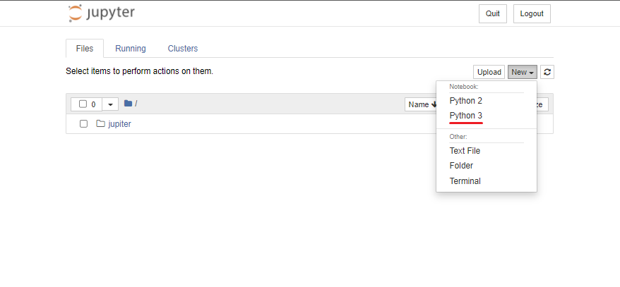
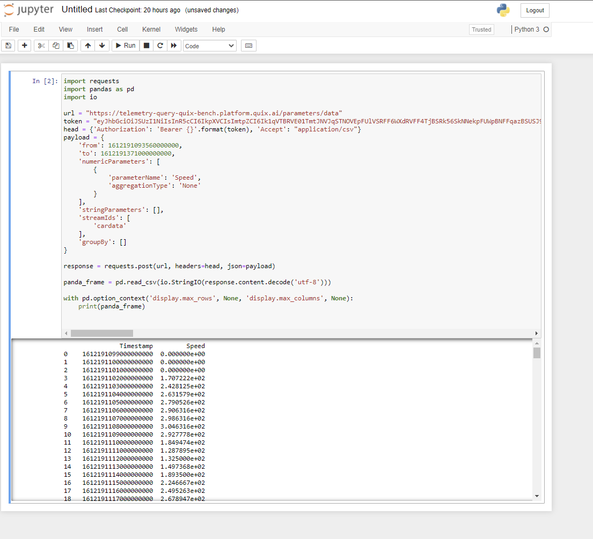

# Use Jupyter notebooks

In this article, you will learn how to use Jupyter Notebook to analyse
data persisted in the Quix platform

## Why this is important

Although Quix is a realtime platform, to build realtime in-memory models
and data processing pipelines, we need to understand data first. To do
that, Quix offers a Data catalogue that makes data discovery and
analysis so much easier.

## Preparation

You’ll need some data stored in the Quix platform. You can use any of
our Data Sources available in the samples Library, or just follow the
onboarding process when you [sign-up to
Quix,window=\_blank](https://portal.platform.quix.ai/self-sign-up?xlink=docs).

You will also need Python 3 environment set up in your local
environment.

### Install required libraries

``` shell
python3 -m pip install jupyter
python3 -m pip install requests
python3 -m pip install pandas
```

### Run Jupyter notebook server

``` shell
jupyter-notebook
```

### Create a new notebook file

Run jupyter with the following command:

\`\`\` jupyter notebook \`\`\`

Then create a new Python3 notebook



## Connecting Jupyter notebook to Data Catalogue

The Quix web application has a python code generator to help you connect
your Jupyter notebook with Quix.

1.  Go to the platform

2.  Select workspace

3.  Go to the Data catalogue

4.  Select data to visualize

5.  Select parameters, events, aggregation and time range

6.  Press **Connect** button

7.  Select **Python** language


Copy Python code to your Jupyter notebook and execute.



!!! tip

	If you want to use this generated code for a long time, replace the temporary token with **PAT token**. See [authenticate your requests](../../apis/data-catalogue-api/authenticate.md) how to do that.

## Too much data

If you find that the query results in more data than can be handled by
Jupyter Notebooks try using the aggregation feature to reduce the amount
of data returned.

For more info on aggregation check out this [short
video](https://youtu.be/fnEPnIunyxA).
